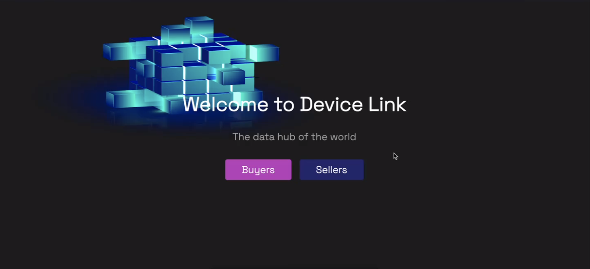

# Device-Link

### Description

Device link is a peer to peer market place that allows users with IoT devices to connect to a LNS (LoRaWAN Network Server) and sell their data to buyers. 

### Demo Video (redirects to youtube)

